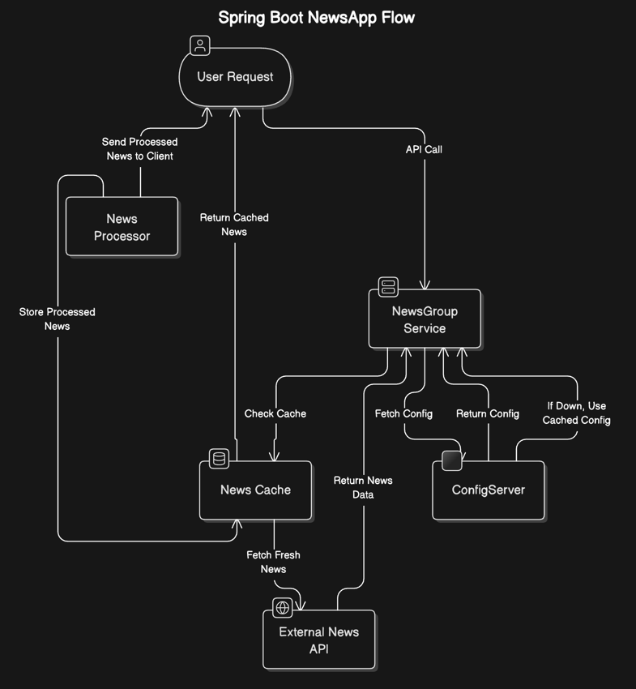

# 📰 NewsApp - Microservices Architecture

## 📖 Overview
NewsApp is a **Spring Boot**-based microservices application that fetches, caches, and groups news articles efficiently. It leverages **RabbitMQ for messaging**, **Spring Cloud Config for centralized configuration**, and **Kubernetes (Minikube) for container orchestration**.

## 🏗️ Architecture & Design

The application consists of the following core services:
- **ConfigServer**: Centralized configuration management using **Spring Cloud Config**.
- **RabbitMQ**: Message broker for event-driven communication.
- **NewsGroup Service**: Fetches, processes, and caches news articles.
- **Kubernetes Deployment**: Services are containerized and deployed using **Helm Charts**.

### 📜 **System Design Flow**
1. **NewsGroup Service** starts and fetches configurations from **ConfigServer**.
2. **RabbitMQ** is used for asynchronous messaging.
3. The **NewsGroup Service** periodically fetches news and caches it.
4. The application is **containerized using Docker** and deployed in **Minikube** via Helm.

---



## Example diagram flow:

User → NewsGroup Service: Request News
NewsGroup Service → ConfigServer: Fetch Configuration
NewsGroup Service → RabbitMQ: Publish News Fetch Event
RabbitMQ → NewsGroup Service: News Processing Acknowledgment
NewsGroup Service → User: Return Cached/Live News


📐 Design Patterns Used
1️⃣ Singleton Pattern
Used in: ConfigServer
Ensures a single instance of the configuration service.
2️⃣ Factory Pattern
Used in: News fetching logic
Abstracts the news provider and selects the correct source.
3️⃣ Circuit Breaker (Resilience4j)
Used in: NewsGroup Service
Prevents failures when news APIs are unreachable

## Setup

1. Clone the repository.
2. Build the project: `./mvnw clean package`.
3. Run the service: `docker-compose up --build`.

## API Endpoints

- `GET /search?keyword=apple&interval=hours&n=12`

## Docker

Build and run the Docker container:

```bash
docker-compose up --build


